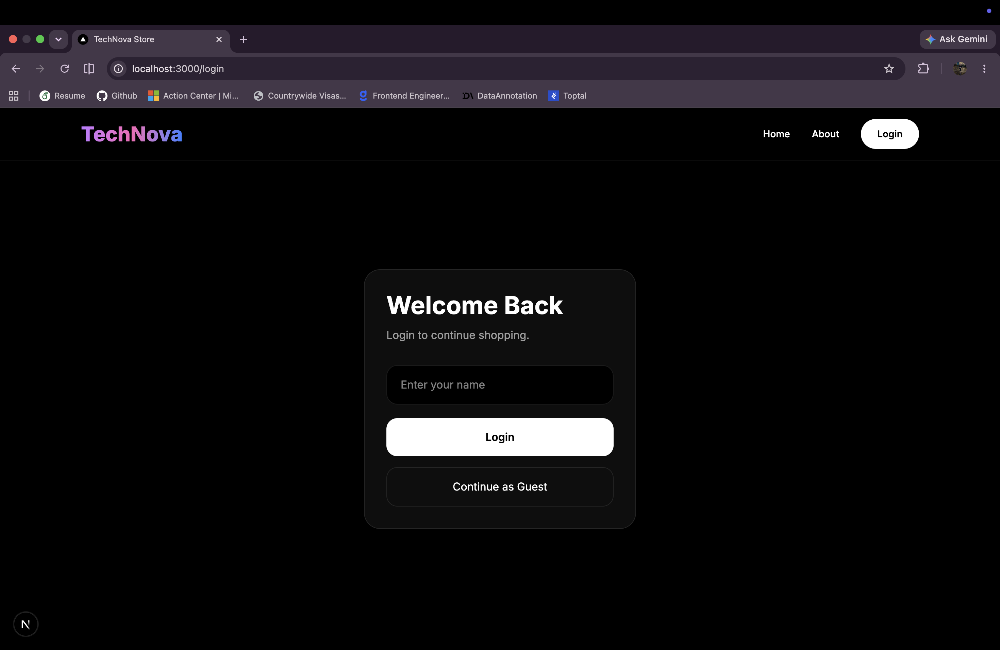
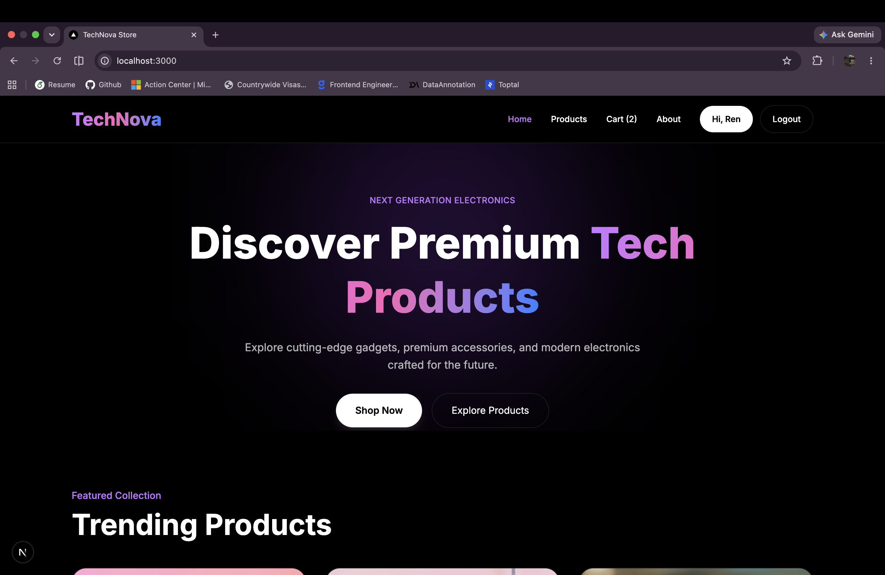
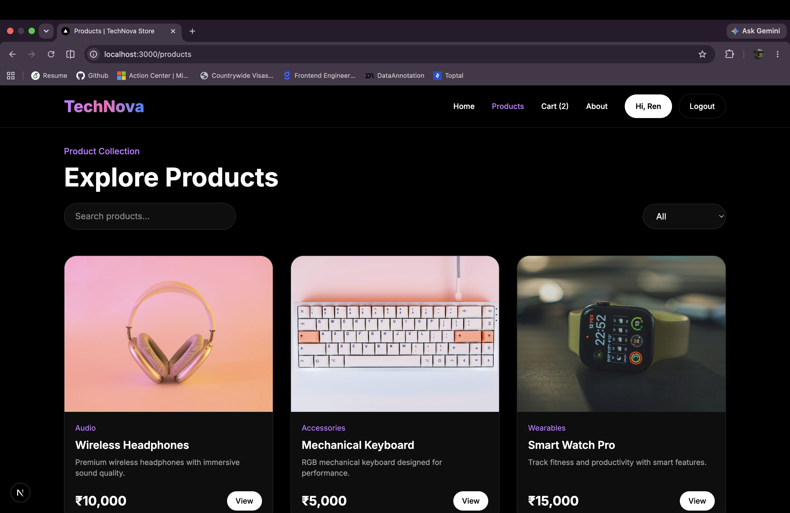
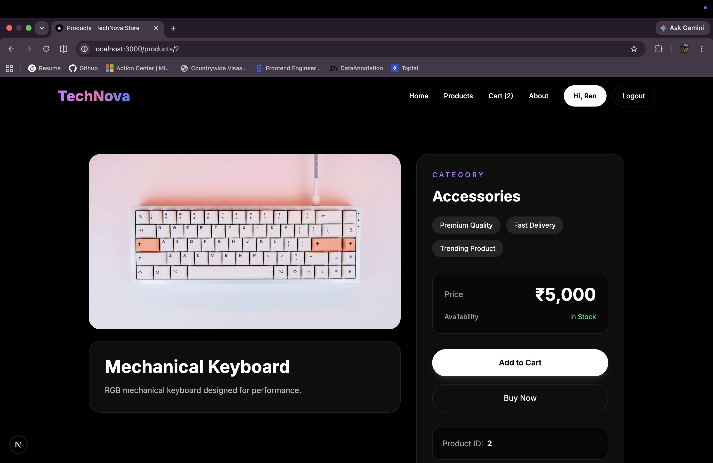
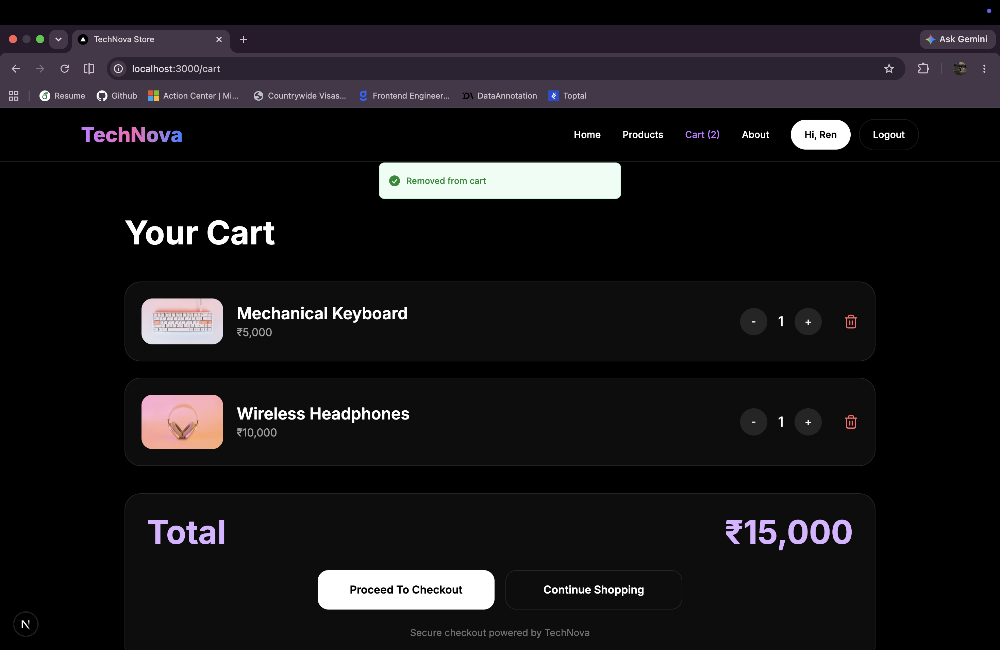

# TechNova Store

Modern ecommerce frontend application built with Next.js, TypeScript, Tailwind CSS, Context API, and localStorage persistence.

## Features

- Authentication flow
- Guest login support
- Protected routes
- Dynamic product pages
- Shopping cart functionality
- Persistent cart storage
- User-specific carts
- Responsive design
- Toast notifications
- Modern UI/UX

## Tech Stack

- Next.js 15
- TypeScript
- Tailwind CSS
- React Context API
- Sonner Toasts

## Installation

```bash
npm install
```

Run development server:

```bash
npm run dev
```

## Live Demo

https://technova-store-hm3mg8npx-renuradharams-projects.vercel.app

## Screenshots

### Login Page



---

### Home Page



---

### Products Page



---

### Product Detail Page



---

### Cart Page



## Author

Built by Renuka Radharam